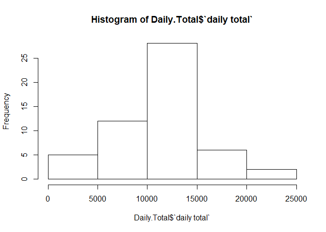
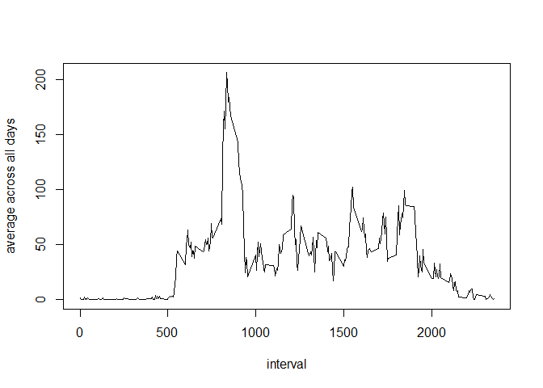
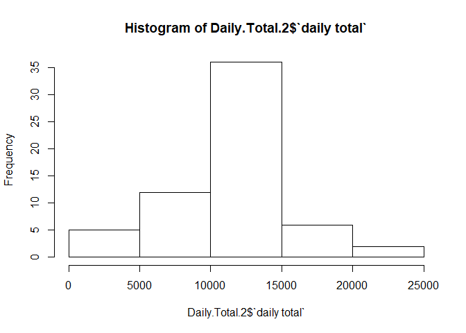
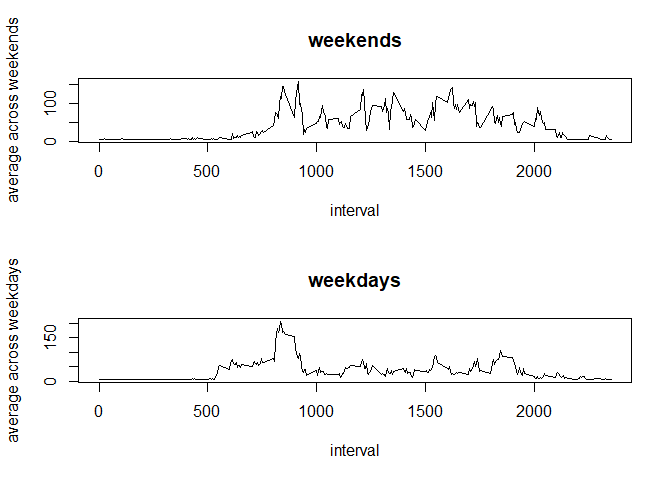

## Loading and preprocessing the data


```r
library(dplyr)
```

```
## 
## Attaching package: 'dplyr'
```

```
## The following objects are masked from 'package:stats':
## 
##     filter, lag
```

```
## The following objects are masked from 'package:base':
## 
##     intersect, setdiff, setequal, union
```

```r
library(lubridate)
```

```
## 
## Attaching package: 'lubridate'
```

```
## The following object is masked from 'package:base':
## 
##     date
```

```r
setwd(dir = '~/R Projects/Reproducible Research/Course Project 1/')
Raw.Data <- read.csv(file = 'activity.csv', header = TRUE)

Tidy.Data <-    Raw.Data %>% 
                mutate(date = ymd(date), time = paste(date ,interval%/%100, interval%%100, sep = " ") %>% ymd_hm()) %>% 
                tbl_df()
```


## What is mean total number of steps taken per day?


```r
## Calculating the total number of steps taken per day
Daily.Total <-  Tidy.Data %>% 
                group_by(date) %>% 
                summarise('daily total' = sum(steps))

hist(Daily.Total$`daily total`)
```

<!-- -->

```r
mean(Daily.Total$`daily total`, na.rm = TRUE)
```

```
## [1] 10766.19
```

```r
median(Daily.Total$`daily total`, na.rm = TRUE)
```

```
## [1] 10765
```


## What is the average daily activity pattern?


```r
## Calculating the average number of steps taken, averaged across all days.
Average.Daily <-        Tidy.Data %>% 
                        group_by(interval) %>%
                        summarise('average across all days' = mean(steps, na.rm = TRUE))

plot(Average.Daily, type = "l")
```

<!-- -->

```r
## Finding the 5-minute interval which , on average, contains the maximum number of steps
Average.Daily %>% filter(`average across all days` == max(`average across all days`))
```

```
## # A tibble: 1 x 2
##   interval `average across all days`
##      <int>                     <dbl>
## 1      835                      206.
```


## Imputing missing values

```r
## Calculating the total number of missing values in the dataset
Good <- complete.cases(Tidy.Data)
nrow(Tidy.Data[!Good,])
```

```
## [1] 2304
```

```r
## Devising a strategy for filling in all of the missing values in the dataset
Five.Min.Average <- mean(Tidy.Data$steps, na.rm = TRUE)

for (i in seq_len(nrow(Tidy.Data))) {
        if (is.na(Tidy.Data$steps[i])) {
                Tidy.Data$steps2[i] <- Five.Min.Average
        }
        else {
                Tidy.Data$steps2[i] <- Tidy.Data$steps[i]
        }
        
}
```

```
## Warning: Unknown or uninitialised column: 'steps2'.
```

```r
## Creating a new dataset that is equal to the original dataset but with the missing data filled in
Tidy.Data.NA.Filled <- Tidy.Data[,c(5,2,3,4)]
## Calculating the total number of steps taken per day
Daily.Total.2 <-        Tidy.Data.NA.Filled %>% 
                        group_by(date) %>% 
                        summarise('daily total' = sum(steps2))

hist(Daily.Total.2$`daily total`)
```

<!-- -->

```r
mean(Daily.Total.2$`daily total`, na.rm = TRUE)
```

```
## [1] 10766.19
```

```r
median(Daily.Total.2$`daily total`, na.rm = TRUE)
```

```
## [1] 10766.19
```


## Are there differences in activity patterns between weekdays and weekends?


```r
## Define a function to determine whether a given date is a weekday or weekend day.
library(timeDate)
f <- function(x) {
        if (isWeekday(x)) {
                x <- c("weekday")
        }
        else {
                x <- c("weekend")
        }
}
## Applying the funtion to the dataset to create a new factor variable with two levels - "weekday" and "weekend"
Tidy.Data.NA.Filled.2 <- Tidy.Data.NA.Filled %>% mutate(weekday = as.factor(sapply(date, f)))

Average.weekdays <-     Tidy.Data.NA.Filled.2 %>% 
                        group_by(interval) %>% 
                        filter(weekday == "weekday") %>% 
                        summarise('average across weekdays' = mean(steps2, na.rm = TRUE))
Average.weekends <-     Tidy.Data.NA.Filled.2 %>% 
                        group_by(interval) %>% 
                        filter(weekday == "weekend") %>% 
                        summarise('average across weekends' = mean(steps2, na.rm = TRUE))
## Making a panel plot containing a time series plot of the 5-minute interval and the average number of steps taken, averaged across all weekday days or weekend days.
par(mfcol = c(2,1))
plot(Average.weekends, type = "l", main = "weekends")
plot(Average.weekdays, type = "l", main = "weekdays")
```

<!-- -->
